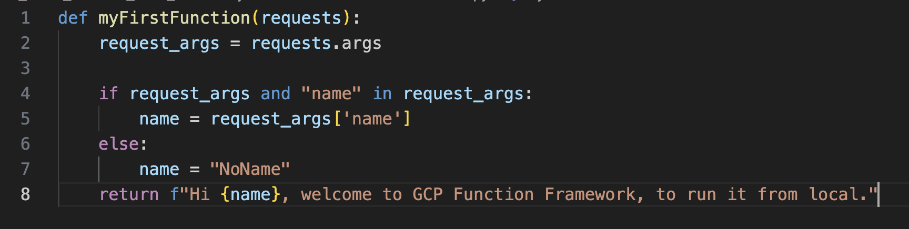
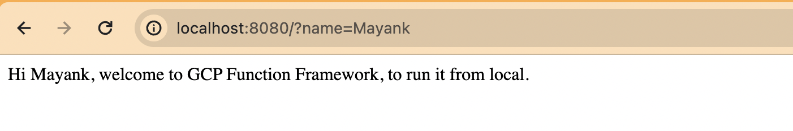

# Google Cloud Functions Framework
In here we are using the Cloud Function (CF) to test locally and then deploy to Cloud.
Also using HTTP as a trigger event.

# What is the Functions Framework?
The Functions Framework lets you write lightweight functions that run in many different environments, including:

* Cloud Functions
* Your local development machine
* Cloud Run

The Functions Framework allows you to:

* Spin up a local development server for quick testing
* Invoke a function in response to a request
* Automatically unmarshal events conforming to the CloudEvents spec
* Be portable between serverless platforms

For more details directly refer to GCP GitHub https://github.com/GoogleCloudPlatform/functions-framework-python 

# Installation
Install the Functions Framework via pip:

`pip install functions-framework`

# Start Coding
To start the coding, first we will create a directory say "myGCPFunctionFramework".
Inside the said dir. create a main.py file which will act as a cloud function.
This function will accepts the argument (optional) from the command line or http request.
This argument will be captured by request parameter.

Just 8 lines of code.

# Run from Local
To run the above created cloud function from local, use below command.
`functions-framework --target myFirstFunction`

One thing to note here is the address of the post request. By default, functions-framework listens to port 8080 at your localhost, so if you need to change the port, you can pass it in as an argument to the function call.

Now navigate to browser and user the url as http://localhost:8080/
Should be able to see the response.

Hurray! our code is working.

Now use the url as http://localhost:8080/?name=Mayank
Note, we are passing the arguments, and it is being reflected in the response.

# Stop the function
The functions-framework doesn't stop running when the function finishes, so you need to interrupt it with Ctrl+C back in terminal 1.

It took me a while to figure all this out, hope it saves you some time :)

# Final Note
To run this you do not need to have a GCP Account. So even if you do not have the GCP account you could run the GCP Cloud Function on your local.
Yet I have not deployed the code to Google Cloud.

# Cloud Function with POST request
If you have any POST request, we could modify our code.

Also we could use CURL or Postman to sent the request.

http://localhost:8080/?name=Mayank&msg=I%20love%20the%20tutorial 

# Facing issue for port: How to fix “Port 8080 already in use” error on a Mac
Refer https://medium.com/@ryanminjaeshin/how-to-fix-port-8080-already-in-use-error-on-a-mac-4e367565c688#:~:text=This%20error%20typically%20means%20that,for%20your%20application%20to%20use.

# Deploy to Google Cloud
As we have tested our code locally, its time to push the function to google cloud.
For this you must have an account for GCP.

Step 1: Install Cloud SDK 
Navigate to browser https://cloud.google.com/sdk/docs/quickstart, and search for Cloud SDK, download and install.
All the instruction are provided.

Step 2: Afetr installation, initialize the gcloud.
    `gcloud init`

Step 3: After initialize, we are all set to deploy our code. Use below code to deploy the Cloud Function into Cloud.

    `gcloud functions deploy myFirstFunction --runtie python39 --trigger-http`

Now you could navigate to Cloud Console and verify if the CF exists there.

